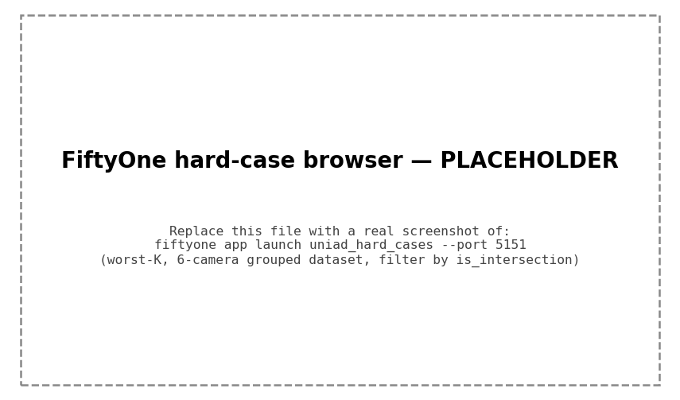
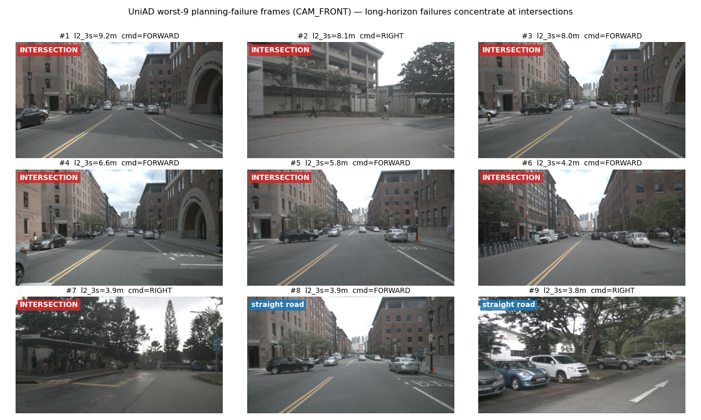
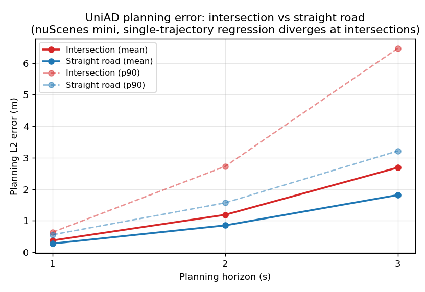

# UniAD 规划失效分析工作台 · UniAD Planning Failure Analysis

> **Evaluation & failure-attribution toolkit for UniAD end-to-end planning.**
> 给 [UniAD](https://github.com/OpenDriveLab/UniAD)（端到端自动驾驶）补一条**逐帧评测 → 长尾难例挖掘 → 可视化 → 数据驱动根因归因**的数据链，
> 并用它**量化定位**了 UniAD 规划模块的一个核心失效模式。

---

## 一句话

UniAD 的 planning head 是**确定性单轨迹回归**。本工作台用逐帧指标 + 场景归因，**量化坐实**：
**长时域规划误差集中在路口** —— 路口未来是多模态（直行/左转/右转都合理），单轨迹回归在模态间发散，
表现为 **「1s 准、3s 飘」**。这正是 VAD / VADv2 / GenAD 转向**多模态规划**的动机。

## 动机

UniAD 官方 eval 把每帧 planning L2 / 碰撞**直接累加成全局平均**，逐帧值算了却没留存 ——
拿不到"哪一帧、为什么失效"，无法做难例挖掘与归因。本项目在**不改变任何官方全局指标数值**的前提下
（逐帧 CSV 各 `L2_*` 列均值**逐位等于**官方全局 PrettyTable），补齐这条链路并做归因。

## 方法（四步）

| 步骤 | 工具 | 说明 |
|------|------|------|
| ① 逐帧指标导出 | `patches/` 对 UniAD eval 的改动 | 每帧 L2(0.5–3.0s)/碰撞 → CSV |
| ② 长尾难例挖掘 | `tools/mine_hard_cases.py` | 按 `l2_3s` 排 worst-K |
| ③ 可视化浏览 | `tools/fiftyone_hard_cases.py` | worst-K 的 6 路相机导入 **FiftyOne** grouped dataset |
| ④ 场景根因归因 | `tools/label_scene_attribution.py` + `tools/plot_attribution.py` | nuScenes map API 打 `is_intersection`，路口 vs 直路分桶 |

**闭环逻辑**：挖掘 worst-K → FiftyOne 肉眼看出"worst 帧几乎都是路口" → map API 打标 → 分桶量化验证假设。

## 关键发现

### FiftyOne 难例浏览器

把 worst-K 的 6 路相机图导入 FiftyOne grouped dataset，附 `l2_3s / command / is_intersection` 字段，
可在浏览器里逐帧排查、按路口/直路筛选并排看。



> worst-K 难例在 FiftyOne 中按 `l2_3s` 排序浏览，全部命中路口（`is_intersection=True`），左侧栏为逐帧评测字段。worst-9 失效帧的 CAM_FRONT 静态拼图见下：



worst-9 失效帧（CAM_FRONT）：#1–7 是路口，#8–9 才是直路。



**路口 vs 直路，L2 mean 比值随时域单调放大**（69 有效帧，路口基率 48%）：

| 时域 | 路口 mean | 直路 mean | **比值** | 路口 p90 | 直路 p90 |
|------|-----------|-----------|----------|----------|----------|
| l2_1s | 0.377 | 0.277 | **1.36×** | 0.64 | 0.56 |
| l2_2s | 1.190 | 0.854 | **1.39×** | 2.73 | 1.57 |
| l2_3s | 2.689 | 1.817 | **1.48×** | **6.47** | **3.22** |

**worst-K 路口率**（全部帧按 `l2_3s` 降序）：top-5 = **100%**、top-10 = 70%、top-20 = 45%（≈基率）。

> 读法：均值比值 1.36→1.48× 印证「1s 准、3s 飘」；l2_3s 的 **p90 路口是直路 2.0×**，
> **最极端 top-5 失效 100% 是路口** —— 路口主导的是**灾难性长尾**，不是平均水平。
> 完整数字见 [`results/intersection_vs_straight.md`](results/intersection_vs_straight.md)。

## 结论

确定性**单轨迹回归**在路口的**多模态未来**下发散，是 UniAD 开环 L2 长尾的主因之一。
方向性结论与 **VADv2（概率式规划）/ GenAD（生成式多模态）** 的改进动机一致 ——
即用多模态/分布式规划替代单点回归来吸收路口处的未来不确定性。

## 语义归因扩展(VLM,诚实负结果)

在上面的**几何归因**(地图 `is_intersection` 客观标签)之上,再加一层**语义归因**:
对同一批 worst-K 难例,用开源 VLM(**Qwen2-VL-2B-Instruct**,fp16)看三路前视相机,强制输出结构化 JSON
(场景描述 / 是否路口 / 关键障碍 / 为什么难 / 建议 meta-action)。**关键设计**:把 VLM 判的
`is_intersection` 对照地图真值,把"主观解释"变成一个可算召回/一致率的客观实验 —— 即把 VLM 也纳入同一套评测框架。

| 步骤 | 工具 | 产物 |
|------|------|------|
| ⑤ VLM 语义归因 | `tools/vlm_hardcase_attribution.py` | `vlm_attribution.csv` + `vlm_fields.json` |
| ⑥ VLM 难例浏览器 | `tools/fiftyone_vlm_hardcases.py` | 三路前视 grouped dataset(`map/vlm is_intersection`、`intersection_mismatch` 字段) |

**结果(诚实记录,负结果)**:worst-15 里地图标了 **8 帧路口**,Qwen2-VL-2B 零样本**全部判 False**
(路口召回 **0%**),且 15 帧 `meta_action` 全塌成 `keep_lane`。表面 **46.7%** 的"一致率"只是非路口帧的
**基率假象**,不可当准确率汇报。

**怎么读 / 下一步**:小 VLM 零样本在难例上发生**输出塌缩 + 任务定义错位**(地图 `is_intersection` 是拓扑标签,
未必在前视里可见)。实证结论:要么上更大模型 / 微调(Qwen2.5-VL-7B 4bit 待验),要么改评测设计
(多相机输入 / 更贴视觉的定义)。**真正的交付物是"VLM 接入评测闭环 + 可视化归因"这条工程链路,而非那个 0% 数字本身。**
完整记录见 [`docs/VLM_HARDCASE_ATTRIBUTION.md`](docs/VLM_HARDCASE_ATTRIBUTION.md)。

```bash
# 前置:已有 output/planning_per_frame_attr.csv(label_scene_attribution.py 产物,含 is_intersection)
# VLM 依赖独立于 UniAD 主环境,建议干净 venv:pip install -r requirements-vlm.txt
python tools/vlm_hardcase_attribution.py \
    --metrics-csv output/planning_per_frame_attr.csv \
    --dataroot data/nuscenes --version v1.0-mini --topk 15 \
    --model Qwen/Qwen2-VL-2B-Instruct \
    --cameras CAM_FRONT_LEFT CAM_FRONT CAM_FRONT_RIGHT \
    --out-csv output/vlm_attribution.csv --fiftyone-json output/vlm_fields.json
# 可视化:三路前视 + map/vlm 路口标签 + 不一致高亮
python tools/fiftyone_vlm_hardcases.py --csv output/vlm_attribution.csv   # 浏览 http://localhost:5151
```

## 运行说明

依赖：`mmdet3d` + UniAD 环境、`nuscenes-devkit`、`fiftyone`、`pandas`、`matplotlib`。

```bash
# 0) 在 UniAD 仓库里应用 eval 改动 (逐帧导出), 见 patches/
cd /path/to/UniAD
git apply /path/to/this/patches/0001-uniad-eval-per-frame-planning-export.patch
# 跑 eval -> output/planning_per_frame.csv
./tools/uniad_dist_eval.sh ./projects/configs/stage2_e2e/base_e2e.py ./ckpts/uniad_base_e2e.pth 1

# 1) 场景归因打标 + 图表
python tools/label_scene_attribution.py --csv output/planning_per_frame.csv
python tools/plot_attribution.py

# 2) 难例挖掘 + FiftyOne 浏览器 (带 is_intersection 字段, 可筛选路口/直路)
python tools/mine_hard_cases.py --csv output/planning_per_frame_attr.csv --k 15
python tools/fiftyone_hard_cases.py --worst-csv output/worst_15_l2_3s.csv --overwrite
fiftyone app launch uniad_hard_cases --port 5151   # 浏览 http://localhost:5151
```

> 对 UniAD eval 的具体改动（逐帧 CSV 导出，非破坏性）：见 [`patches/`](patches/)，
> 或我的 UniAD fork 分支 **[github.com/SailorChiu/UniAD/tree/stage1-eval-export](https://github.com/SailorChiu/UniAD/tree/stage1-eval-export)**。

## 技术栈

`UniAD` / `BEVFormer` · `mmdetection3d` · `PyTorch` · `nuScenes-devkit`（map API 路口判定）·
`FiftyOne`（多相机 grouped dataset 难例浏览器）· `pandas` / `matplotlib`（归因统计与可视化）·
`Qwen2-VL` / `transformers`（难例语义归因 VLM，纳入可度量评测）

## 诚实标注 / 边界

- **当前在 nuScenes-mini（81 帧）验证，重点是方法管线与归因方向正确**；
  路口桶仅 33 帧，**不追求统计显著性**。
- 要得到可写入报告的"规划失效 X% 来自路口"的数字，需在 **全量 nuScenes val（~300G）** 复算 —— 方法可直接平移。
- 路线图：逐帧 CSV 增加**检测 FN / occ 覆盖率**列做二级归因（"路口失效里多少叠加了上游感知漏检"）；
  把 pred/GT 轨迹叠到 BEV / 前视图增强可视化。

## results/

| 文件 | 内容 |
|------|------|
| `planning_per_frame.sample.csv` | mini 81 帧逐帧 planning 指标样例 |
| `intersection_vs_straight.md` | 路口 vs 直路分桶完整表 + worst-K 路口率 |
| `intersection_l2.png` | L2-随时域发散图（mean + p90）|
| `worst_k_montage.png` | worst-9 失效帧 CAM_FRONT 拼图（含路口标注）|
| `fiftyone_browser.png` | FiftyOne 难例浏览器截图（worst-K 路口难例，按 l2_3s 排序）|
